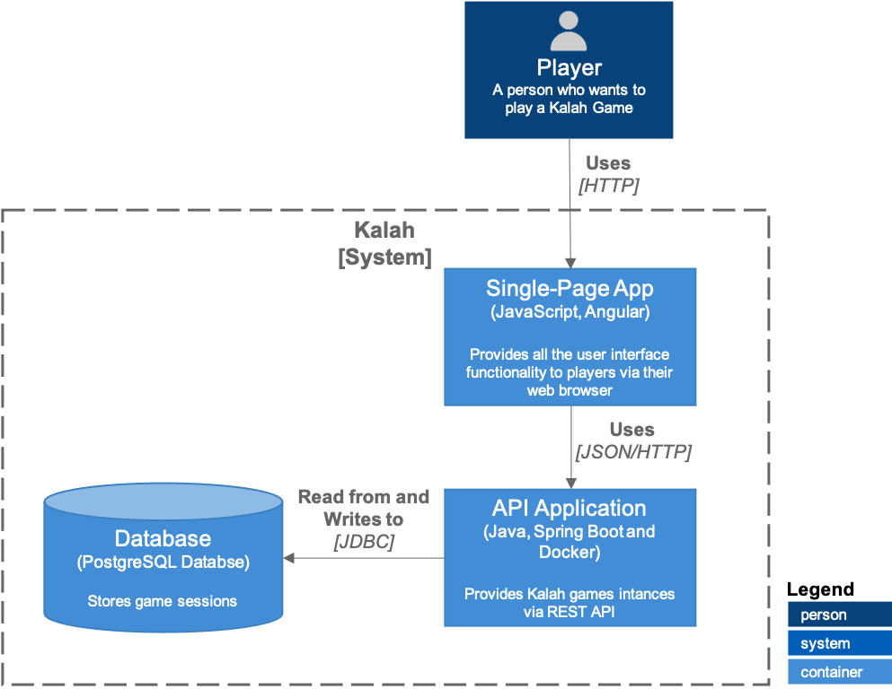

<h1>Kalah Implementation</h1>

[**Game Rules**](https://en.wikipedia.org/wiki/Kalah)

<!-- prettier-ignore-start -->
[![MIT License][license-badge]][license]
<!-- prettier-ignore-end -->

## Table of Contents
<!-- START doctoc generated TOC please keep comment here to allow auto update -->
<!-- DON'T EDIT THIS SECTION, INSTEAD RE-RUN doctoc TO UPDATE -->

<!-- END doctoc generated TOC please keep comment here to allow auto update -->

## About
Kalah, also called Kalaha, is a copy of the ancient game mancala trademarked in the United States by William Julius Champion, Jr. in 1940. This game is sometimes also called "Kalahari", possibly by false etymology from the Kalahari desert in Namibia.

The game provides a Kalah board and a number of seeds or counters. The board has 6 small pits, called houses, on each side; and a big pit, called an end zone, at each end. The object of the game is to capture more seeds than one's opponent.

1. At the beginning of the game, four seeds are placed in each house. This is the traditional method.
2. Each player controls the six houses and their seeds on the player's side of the board. The player's score is the number of seeds in the store to their right.
3. Players take turns sowing their seeds. On a turn, the player removes all seeds from one of the houses under their control. Moving counter-clockwise, the player drops one seed in each house in turn, including the player's own store but not their opponent's.
4. If the last sown seed lands in an empty house owned by the player, and the opposite house contains seeds, both the last seed and the opposite seeds are captured and placed into the player's store.
5. If the last sown seed lands in the player's store, the player gets an additional move. There is no limit on the number of moves a player can make in their turn.
6. When one player no longer has any seeds in any of their houses, the game ends. The other player moves all remaining seeds to their store, and the player with the most seeds in their store wins.

It is possible for the game to end in a draw.

This solution consists of two applications implemented using Java (Spring Boot Service) and Javascript (Angular Framework) which implements the business logics of the Kalah game, details of each application are pointed below:

* `kalah-backend`: Spring Boot service, responsible for creating and managing the game sessions which are stored in a PostgreSQL database server.

* `kalah-frontend`: Angular project responsible for the user interface, it comunicates with the `kalah-backend` in order to create plays and update the status of the gaming board as well as, beign responsible for presenting the game winner once the game ends.

## Architecture

## Technologies
* `Spring Boot v2.5.0`, for creating RESTful API;
* `Spring Data`, for managing the Database Server entities;
* `JUnit`, used for unit testing of the application;
* `Swagger`, used for API documentation;
* `Lombok`, used for annotating getters and setters methods;
* `Model Mapper`, used for object mapping;
* `PostgreSQL`, used to store the necessary data;
* `Docker and Docker-Compose`, containerization of the services and linking containers;
* `Angular v12`, implementation of user interface;
* `Angular Material`, Material Design components used in the application layout;
* `Angular Flex Layout`, creation of responsive layouts;

## Installation
Follow these instructions in order to try the application.

### Prerequisites
Make sure you have installed all of the following prerequisites on your development machine:
* `Node.JS` and `Angular CLI`, for building the `kalah-frontend`;
* `Java 11` and `Maven`, for building the `kalah-backend`;
* `Docker` and `Docker-Compose`, to build and run the application containers;

Also make sure that the following ports are available:
* `80`, used for the nginx container holding the `kalah-frontend`;
* `8080`, used for the openjdk container holding the `kalah-backend`;
* `5050`, used for the pgAdmin application;
* `5432`, used for the PostgreSQL Database Server;

### 1. Kalah Frontend Application
Execute the following commands in order to build and generate the docker container images:
1. Enter the `kalah-frontend` folder:  
``$ cd kalah-frontend ``  
2. Install the node dependencies:  
``$ npm install``  
3. Build the distributable application:  
``$ ng build``  
4. Execute the Docker build to generate the docker container image:  
``$ docker build -t kalah-frontend .``

### 2. Kalah Backend Application
Execute the following commands in order to build and generate the docker container images:

1. Enter the `kalah-backend` folder:  
``$ cd kalah-backend``
2. Execute the following maven command to clean the target folder and generate the distributable .jar file:  
``$ mvn clean install``  
3. Execute the Docker build to generate the docker container image:  
``$ docker build -t kalah-backend .``  

### 3. Kalah Application (Docker-Compose)
From the root folder of this project execute the following commands.
1. First check if the images were successfully generated using the command:  
``$ docker image ls``  

2. Execute the following command to setup the whole application and deploy:  
``$ docker-compose up -d``

3. You can access the frontend application accessing the following address:  
``http://localhost``

## Future Improvements
* `kalah-frontend`: 
  * Create a user session management module in order to authenticate and enable multi/single player sessions;
  * Creation of a matchmaking module to manage the current available games waiting for new players;
  * Implementation of Lazy Loading on modules in order to keep the frontend application performant;
  * Creation of new components to divide better the responsabilities between the communications with REST APIs;

* `kalah-backend`:
  * Management of players and their sessions using JWT tokens;
  * Matchmaking mechanism to enable online multiplayer gameplay;
  * Implementation of an Artificial Intelligence module to create singleplayer sessions possible;
  * Code instrumentation to collect service metrics (CPU and Memory usage, etc.) and forwarding to services like Elasticsearch or Grafana for data visualization;
  * Implementation of caching systems like Redis to improve performance of the system;
  * New implementations should consider a microservices architecture in order to be scalable to manage as much users/game sessions in parallel as possible;

* `General`:
  * Project build, versioning and deployment automatization using any CI/CD service;
  * Re-design of the solution to be a Cloud Native application beign capable of handling with autoscaling (Kubernetes and Cloud Native Apps can be considered);

## Contributors
Nathan Ribeiro
* [Github](https://github.com/nathanlogus)
* [LinkedIn](https://www.linkedin.com/in/nathanlogus/)

## LICENSE

[MIT](LICENSE)

<!-- prettier-ignore-start -->
[license-badge]: https://img.shields.io/npm/l/@testing-library/react.svg?style=flat-square
[license]: https://github.com/nathanlogus/kalah/blob/main/LICENSE
<!-- prettier-ignore-end -->
